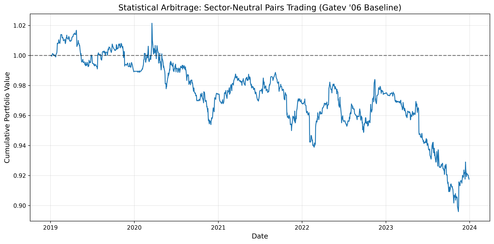

# Statistical Arbitrage: Sector-Constrained Pairs Trading using the Gatev Distance Framework


## Overview

This project implements a systematic equity statistical arbitrage strategy based on the classical distance-based pairs trading framework introduced by Gatev, Goetzmann, and Rouwenhorst (2006).

The objective is to identify historically similar stocks, monitor temporary divergences in their relative price behavior, and exploit subsequent mean reversion through market-neutral long-short positions.

To improve robustness in modern market environments, the baseline Gatev methodology is extended with:

- Sector-constrained pair selection
- Rolling formation and trading windows
- Transaction cost modeling
- Stop-loss controls
- Maximum holding period constraints
- Cooldown periods to mitigate excessive re-entry

The project emphasizes backtesting integrity through strict chronological train-test separation, walk-forward validation, and elimination of lookahead bias.

---

## Research Methodology

### Formation Period

Pairs are selected using a 12-month formation window.

For each stock:

1. Daily adjusted closing prices are collected.
2. Price series are normalized to a common starting value.
3. Sum of Squared Deviations (SSD) is computed between all eligible stock pairs.

Pair similarity is measured using:

$$
SSD = \sum_{t=1}^{T}(P_{1,t} - P_{2,t})^2
$$

where $P_1$ and $P_2$ represent normalized price paths.

Only stocks belonging to the same GICS sector are eligible for pairing, reducing exposure to spurious correlations driven by macroeconomic events.

The top-ranked pairs with the lowest SSD values are selected for trading.

---

### Trading Period

Selected pairs are traded during the subsequent 6-month trading window.

For each pair:

- Historical spread mean and volatility are estimated from the formation period.
- Entry signals are generated when spreads deviate by more than two standard deviations from their historical mean.
- Positions are closed when the spread converges toward its historical equilibrium.

#### Trading Rules

**Long Spread**

$$
Spread < Mean - 2\sigma
$$

**Short Spread**

$$
Spread > Mean + 2\sigma
$$

#### Exit Conditions

- Mean reversion
- 4σ stop-loss
- Maximum holding period of 30 trading days

A cooldown period is enforced after exits to prevent excessive trade clustering.

---

### Walk-Forward Framework

The strategy is evaluated using a rolling walk-forward framework:

- Formation Window: 252 trading days
- Trading Window: 126 trading days

At the end of each trading period:

- Existing pairs are discarded.
- New pairs are selected using the latest formation data.

This process allows the strategy to adapt to changing market conditions and mitigates pair decay over time.

---

## Quantitative Engineering Considerations

The implementation incorporates several safeguards commonly used in professional systematic trading research.

### Lookahead Bias Prevention

Signals are generated using only information available at the decision timestamp. Trades are executed on the following trading day, ensuring realistic signal execution.

### Sector Neutrality

Pair selection is restricted to stocks within identical GICS sectors. 

Examples of valid pairs evaluated:

- **META – GOOGL** (Communication Services)
- **MSFT – AAPL** (Information Technology)
- **CVX – XOM** (Energy)

This reduces exposure to regime-dependent cross-sector correlations.

### Transaction Cost Modeling

Each completed trade includes explicit transaction costs (6 basis points) to account for commissions and execution slippage across both legs.

### Risk Controls

The strategy utilizes standard deviation stop-losses, maximum holding periods, rolling pair re-selection, and trade cooldown mechanisms to prevent capital from becoming trapped in structurally broken relationships.

---

## Performance Evaluation

Performance is evaluated on a fully out-of-sample basis using the rolling walk-forward framework. 

### Equity Curve



### Performance Summary

| Metric | Value |
| :--- | :--- |
| **Total Trades** | 251 |
| **Total Return** | -8.24% |
| **Annualized Return** | -1.71% |
| **Annualized Volatility** | 3.65% |
| **Sharpe Ratio** | -0.45 |
| **Max Drawdown** | -12.29% |
| **Trade Win Rate** | 46.61% |
| **Avg. Holding Days** | 21.6 |

## Limitations & Assumptions

- **Survivorship Bias:** Uses today’s S&P 500 constituents for historical backtests, excluding firms that were delisted or went bankrupt, leading to inflated returns.
- **Execution Assumptions:** Assumes perfect execution at closing prices with no delay, slippage, market impact, or overnight gap risk.
- **Static Slippage & Costs:** Applies fixed transaction costs and ignores liquidity-driven slippage and volatility spikes during stressed markets.
- **Model Risk:** SSD-based pairing captures price similarity, not true cointegration, allowing structurally non-mean-reverting pairs.
- **Fixed Thresholds:** Uses constant $2\sigma$ entry and $4\sigma$ exit rules, ignoring regime-dependent volatility dynamics.
- **Capital & Margin Assumptions:** Assumes infinite capital, perfect fractional allocation, and no margin constraints or forced liquidation risk.

## Installation & Execution

### Prerequisites
Python 3.10+

### Clone Repository
```bash
git clone https://github.com/UnEthicalMK/pairs-trading.git
cd pairs-trading-gatev
```
### Virtual Environment
```bash
python -m venv .venv
```
```bash
# Windows
.venv\Scripts\activate
```
```bash
# macOS/Linux
source .venv/bin/activate
```
### Install Dependencies
```bash
pip install -r requirements.txt
```

### Run the Pipeline

```bash
python main.py
```

## Reference

Gatev, E., Goetzmann, W. N., & Rouwenhorst, K. G. (2006).  
*Pairs Trading: Performance of a Relative-Value Arbitrage Rule.*  
Review of Financial Studies, 19(3), 797–827.  
https://doi.org/10.1093/rfs/hhj020
